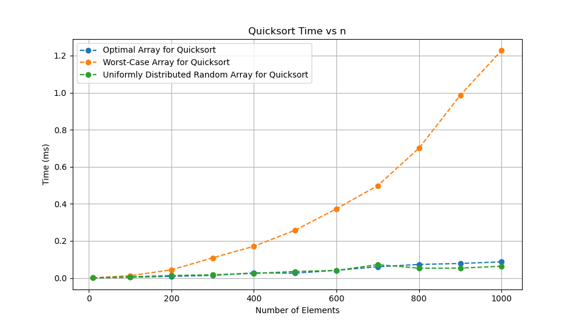

# CSE5311-Hands-On-6
### To Compile:
```
cd implementation/quick_sort
make
```
### To Run:
```
./qsort
```
### Output:
[qsort_output.txt](qsort_output.txt)

### Test Data Used:
All defined under this directory `implementation/quick_sort/array_data`

### Benchmark Graph


### Best Case (Each pivot divides subarray evenly)
```math
T(1) = 1
```
```math
T(n) = T(n/2) + T(n/2 - 1) + O(n)
```
```math
T(n) \approx 2T(n/2) + cn
```
```math
T(n) \approx 4T(n/4) + 2cn/2 + cn = 2^i*T(n/2^i) + i*n
```
```math
n/2^i = 1
```
```math
i = lg(n)
```
```math
T(n) \approx 2^{lg(n)}T(1) + n*lg(n) = n + n*lg(n)
```
```math
T(n) = O(nlgn)
```
### Worst Case
```math
T(1) = 1
```
```math
T(0) = 1
```
```math
T(n) = T(0) + T(n-1) + O(n)
```
```math
T(n) = T(n-2) + (n-1) + n = T(n-k) + \sum_{i=0}^{k-1}(n-i)
```
```math
n-k = 1
```
```math
k = n-1
```
```math
T(n) = T(1) + \sum_{i=0}^{n-2}(n-i) = n^2
```
### Average
```math
T(n) = T(\alpha n) + T((1 - \alpha)n) + O(n)
```
```math
0 < a < 1
```
On average, quicksort will split the array into some ratio. As long as the ratio does not result in the worst case, any ratio will always lead towards O(nlgn) running time. For instance, a biased 9-to-1 ratio.
```math
T(n) = T((9/10)n) + T((1/10)n) + n
```
Assume $T(n) <= c*nlgn + n$
```math
T(n) = T((9/10)n) + T((1/10)n) + n \leq c(9/10)nlg((9/10)n) + c(1/10)nlg((1/10)n) + n
```
```math
T(n) \leq c((9/10)nlgn + (1/10)nlgn + (9/10)nlg(9/10) + (1/10)nlg(1/10)) + n
```
Note: $(9/10)nlg(9/10)$ and $(1/10)nlg(1/10)$ are both negative terms
```math
T(n) \leq c(nlgn + (9/10)nlg(9/10) + (1/10)nlg(1/10)) + n \leq c(nlgn) + n
```
Thus
```math
T(n) \leq cnlgn + n
```
Therefore, even under biased splits qsort will still perform within $O(nlgn + n) = O(nlgn)$.
